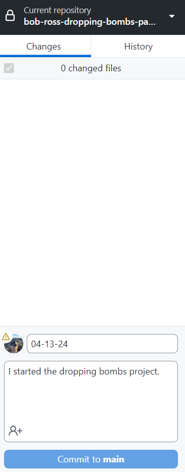

# Unity Project Setup and Management Guide With GitHub Desktop 🚀

## Table of Contents
- [Preparing for Students](#preparing-for-students)
  - [GitHub Desktop](#github-desktop)
  - [Unity](#unity)
- [Handling Student Sessions](#handling-student-sessions)
  - [Student Arrival](#student-arrival)
  - [Starting a New Project](#starting-a-new-project)
  - [Saving the Project to GitHub](#saving-the-project-to-github)
  - [Continuing an Existing Project](#continuing-an-existing-project)
- [Troubleshooting](#troubleshooting)
  - [Troubleshooting Large Files with Git LFS](#troubleshooting-large-files-with-git-lfs)
  - [Troubleshooting Long Filename Issues in Git on Windows](#troubleshooting-long-filename-issues-in-git-on-windows)
  - [Filename Too Long Error During Cloning From Remote Repo](#filename-too-long-error-during-cloning-from-remote-repo)

## Preparing for Students

### GitHub Desktop
- Ensure GitHub Desktop is installed on the machine. If not, download it [here](https://central.github.com/deployments/desktop/desktop/latest/win32).
- Sign into GitHub Desktop with the center GitHub account, the credentials are in the center discord general channel. You must also be signed into GitHub.com for authentication.

### Unity
1. **Unity Hub Check:** Ensure both Unity Hub and the Unity environment are installed. Search for `unity` to verify.
2. **Download and Install (if needed):** If Unity is not installed, download it from the [Unity Download Page](https://unity.com/download).
3. **Account Sign-In:** Use the credentials in the center discord general channel to sign into the center account. Allow students to use their own accounts if available.

## Handling Student Sessions

### Student Arrival
Determine the student's goal:
- 🆕 [Starting a New Project](#starting-a-new-project)
- 🔄 [Continuing an Existing Project](#continuing-an-existing-project)
---

### Starting a New Project

#### 🛠️ Step 1: Creating a Local Repository
1. **Open GitHub Desktop:** Assuming you're already signed in, navigate to `File > New Repository`.

3. **Repository Details:**
   - **Name:** Format the repository name as `firstname_lastname_project_name`.
   - **Description:** Leave this field empty to keep things neat.
   - **Local Path:** Set the path to your desktop, e.g., `C:\Users\logan\Desktop`.
   - **Initialize Options:** No README, .gitignore, or License. Keep it simple!
     

#### 🚀 Step 2: Publishing to GitHub
1. **Publish Repository:** Click the 'Publish Repository' button in GitHub Desktop.
 
 

3. **Remote Repository Settings:**
   - **Repository Name:** Should match the local repository name.
   - **Privacy:** Make sure the repository is public—uncheck any options for privacy.
   - Once that's taken care of, publish the repo!
   

#### 🎮 Step 3: Setting Up the Project
1. **Create a Unity Project:** Fire up Unity and establish a new project in the directory you set on your desktop.
   - **Project Name:** Stick to the `firstname_lastname_project_name` convention.
   

### Saving the Project to GitHub

1. **Prepare to Save:** ⏰ About 10 minutes before wrapping up, ensure students save their Unity project and close the application.
2. **Commit Changes:**
   - **Check Repository:** Make sure you're in the correct repository on GitHub Desktop.
   - **Summary & Description:** Fill in the 'Summary' with the **current date** and let students detail their progress in the 'Description'.
   - **Commit to Main:** Hit that 'Commit to main' button and push the changes online.
     
   
---
### Continuing an Existing Project
1. **Access GitHub Desktop:** Assuming you're already logged in, navigate to `File > Clone Repository`.

3. **Select the Project:**
   - Choose the repository named `firstname_lastname_project_name`.
   - **Local Path:** Ensure the location is set to `C:\Users\user\Desktop`.
   - **Clone:** Hit the 'Clone' button.
   
4. **Initialize Git LFS:** If prompted, activate Git LFS by clicking the blue button. This is crucial for handling large files!

6. **Open Unity Hub:** Select `Add->Add Project from Disk`, browse to the cloned repository directory, and open the project.


8. **Work and Save:** Let students work on their project. As they wrap up (⏰ 10 minutes before the session ends), remind them to [save their changes to GitHub](#saving-the-project-to-github).

---

# Troubleshooting

## Troubleshooting Large Files with Git LFS

### **Example, also notice how it tells you the filename that is too large as well, that is what you track.**

---

### Step 1: Install Git LFS
First, you need to install Git LFS on your system. Open your command prompt or terminal and install Git LFS by running:

```bash
git lfs install
```

**This command configures Git LFS to be used in any repository on your system.**

--- 
### If you get this error that git isn't recognized, then you have to [install git](https://github.com/git-for-windows/git/releases/download/v2.45.2.windows.1/Git-2.45.2-64-bit.exe)

--- 

### Step 2: Navigate to Your Local Repository assuming git is installed
Using the command line, navigate to the local repository where you are encountering the large file issue:

```bash
cd path/to/your/repository
```

Replace `path/to/your/repository` with the actual path to your local Git repository.

### Step 3: Track Large Files with Git LFS
Identify the file types mentioned in the error message (for example, `.dylib`). Use Git LFS to track these file types by running:

```bash
git lfs track "*.dylib"
```

--- 
### **Example**

--- 
Replace the file patterns with those relevant to your specific situation.

### Step 4: Update .gitattributes
The `git lfs track` command updates the `.gitattributes` file, marking the specified file types to be handled by Git LFS. You need to add and commit this file to your repository:

```bash
git add .gitattributes
git commit -m "Configure Git LFS tracking"
```

### Step 5: Commit Changes Using GitHub Desktop
After setting up Git LFS in the command line:

1. Open GitHub Desktop.
2. Navigate to your repository.
3. You should now be able to commit the previously troublesome large files through GitHub Desktop without encountering size limitations.
4. Commit your changes as usual in GitHub Desktop and push them to the remote repository.


## Troubleshooting Long Filename Issues in Git on Windows

--- 
### **If you get an error window, and "filename too long" is on it, then follow the steps below.**

--- 

### Step 1: Open PowerShell as Administrator

To modify system-level configurations, you need to run PowerShell with administrative privileges:

1. Click on the Start menu.
2. Type `PowerShell`.
3. Right-click on the `Windows PowerShell` icon, and select `Run as administrator`.
4. Click `Yes` on the User Account Control prompt to allow the app to make changes.

### Step 2: Configure Git to Handle Long Paths

With PowerShell running as an administrator, execute the following command to allow Git to handle long paths:

```bash
git config --system core.longpaths true
```

This command configures Git at the system level to support file paths longer than the traditional Windows limit.

### Step 3: Verify Configuration

To ensure the configuration has been successfully applied, use the following command:

```bash
git config --get core.longpaths
```

If the setting is correctly applied, it will return `true`.

### Step 4: Apply the Configuration to Your Repository

Navigate to your repository's directory in PowerShell and apply the configuration locally if you prefer not to set it system-wide:

```bash
cd path/to/your/repository
git config core.longpaths true
```

Replace `path/to/your/repository` with the actual path to your Git repository.

--- 
### Here's an example of what the whole process looks like in powershell
- you will start in `system32`, you have to cd.. out of it and navigate to the local repo

--- 

### Step 5: Retry Your Git Operations

After applying the configuration, return to GitHub Desktop and commit the changes, then push to the remote repo.
---

## Filename too long error during cloning from remote repo
  - If that error is encountered, manually download the zip repo file from github.com, unzip it into a folder on the desktop, load it into unity and let them work on the project that way
  - Once they finish, refer to [Continuing a Different Project](#continuing-an-existing-project)
---

